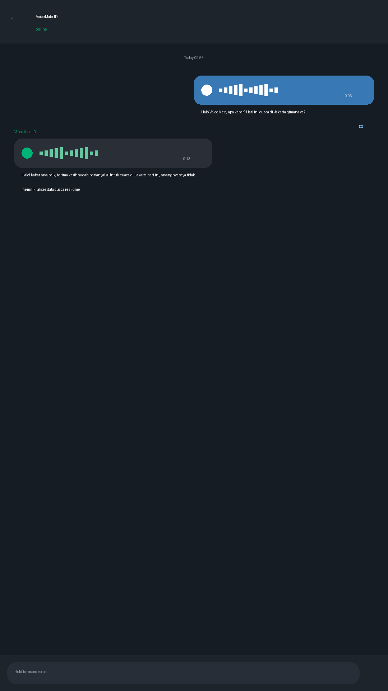

# VoiceMate ID

Indonesian voice-first AI assistant on Telegram. Send a voice note in Bahasa Indonesia, get a thoughtful spoken reply back. Fully voice-in, voice-out — powered entirely by **Xiaomi MiMo**.



## How it works

```
🎙️ Voice note (BI)
    ↓
🧠 mimo-v2-omni    → speech-to-text
🧠 mimo-v2.5-pro   → reasoning + answer
🧠 mimo-v2.5-tts   → text-to-speech
    ↓
🔊 Voice reply (BI)
```

All three AI stages run on Xiaomi MiMo. No OpenAI, no Whisper, no external AI dependencies.

## Why this exists

Indonesian users mostly *talk* with their phones, not type. Most AI assistants are text-first or English-first. VoiceMate ID flips that: open Telegram, hold record, talk in Bahasa Indonesia, get a spoken answer back in seconds.

It is a showcase of what Xiaomi MiMo's reasoning + TTS stack can do when wired together for a real, daily use case — voice conversation in Indonesian, end to end.

## Features

- 🎙️ **Voice in** — send any Telegram voice note in Bahasa Indonesia
- 🧠 **Reasoning** — answers powered by `mimo-v2.5-pro` with conversation memory
- 🔊 **Voice out** — replies sent back as voice notes via `mimo-v2.5-tts`
- 💬 **Text fallback** — replies also sent as text so you can read along
- 🇮🇩 **Indonesia-native** — prompts, persona, voices tuned for Bahasa Indonesia
- 🪶 **Lightweight** — single Python service, ~200 lines of core code
- 🔑 **Single API key** — everything runs through one MiMo API key

## Stack

- Python 3.11+
- [python-telegram-bot](https://github.com/python-telegram-bot/python-telegram-bot) — Telegram bot framework
- [Xiaomi MiMo Open Platform](https://platform.xiaomimimo.com/) — all AI (STT, reasoning, TTS)

## Quick start

### 1. Install

Requires [uv](https://github.com/astral-sh/uv).

```bash
git clone https://github.com/AlfianEn/voicemate-id.git
cd voicemate-id
uv sync
```

### 2. Configure

```bash
cp .env.example .env
```

Fill in:

- `TELEGRAM_BOT_TOKEN` — from [@BotFather](https://t.me/BotFather)
- `MIMO_API_KEY` — from [Xiaomi MiMo Platform](https://platform.xiaomimimo.com/)

That's it. One key for everything.

### 3. Run

```bash
uv run voicemate-bot
```

Talk to your bot on Telegram with a voice note.

## Project layout

```
voicemate-id/
├── src/voicemate/
│   ├── __init__.py
│   ├── __main__.py        # entry point
│   ├── config.py          # env-based settings
│   ├── bot.py             # Telegram handlers
│   ├── stt.py             # speech-to-text (mimo-v2-omni)
│   ├── llm.py             # reasoning (mimo-v2.5-pro)
│   ├── tts.py             # text-to-speech (mimo-v2.5-tts)
│   └── memory.py          # per-user conversation memory
├── demo/                  # demo assets and video frames
├── tests/
├── .env.example
├── pyproject.toml
└── README.md
```

## MiMo models used

| Stage | Model | What it does |
|-------|-------|-------------|
| STT | `mimo-v2-omni` | Multimodal model — listens to audio, transcribes to text |
| Reasoning | `mimo-v2.5-pro` | Thinks and generates the reply in Indonesian |
| TTS | `mimo-v2.5-tts` | Speaks the reply back as a natural voice note |

Available TTS voices: `Mia`, `Chloe`, `Milo`, `Dean`, `mimo_default`, `冰糖`, `茉莉`, `苏打`, `白桦`

## Roadmap

- [x] Telegram voice bot with full voice-in/voice-out flow
- [x] MiMo v2.5 Pro reasoning integration
- [x] MiMo v2.5 TTS integration (chat completions + audio modality)
- [x] MiMo v2 Omni STT (multimodal audio input — no OpenAI needed)
- [x] Per-user conversation memory
- [x] Demo video
- [ ] Deploy guide (systemd unit + Docker)
- [ ] WhatsApp adapter (stretch)
- [ ] Voice selection via bot command

## License

MIT — see [LICENSE](LICENSE).

## Acknowledgements

Built for the [Xiaomi MiMo Orbit 100T Token Plan](https://100t.xiaomimimo.com/) creator program.
